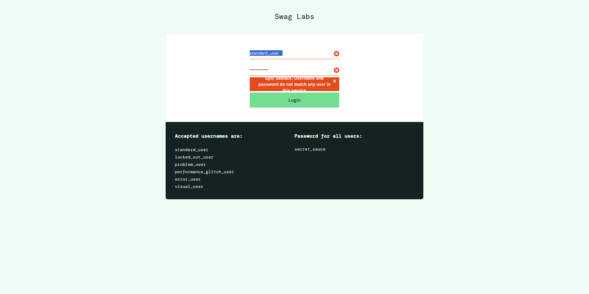

## 🐞 #01 [Login] Falha ao autenticar com espaços no início/fim do username
Ao inserir um username válido com espaços em branco no início e/ou fim, o sistema não autentica o usuário e exibe mensagem de erro, mesmo com credenciais corretas.    

## 🔁 Passos para reproduzir
1. Acessar https://www.saucedemo.com/
2. No campo **Username**, inserir **" standard_user "** (com espaços no início e/ou fim)
3. No campo **Password**, inserir **secret_sauce** 
5. Clicar no botão **Login**

## ❌ Resultado Atual
Sistema exibe a mensagem:
**"Epic sadface: Username and password do not match any user in this service"**
e não realiza o login.

## ✅ Comportamento Esperado
O sistema deve autenticar usuários válidos ao inserir credenciais corretas, independentemente de espaços em branco acidentais no início ou fim do campo **Username**.

## 💥 Impacto
Usuários válidos podem não conseguir acessar a aplicação devido a entrada com espaços acidentais, impactando a experiência e potencialmente aumentando tentativas de login incorretas.

## 🚨 Severidade | ⏱️ Prioridade
Média | Média

## 🌍 Ambiente Testado
- SO: Linux e Android
- Navegadores: Chrome (147.0.7727.137) e Firefox (150.0.1)

## 📸 Evidência
