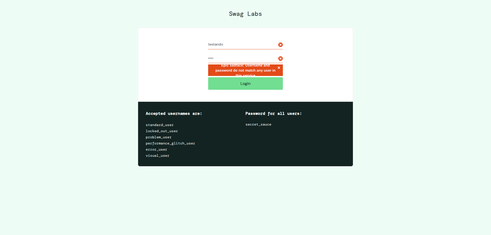
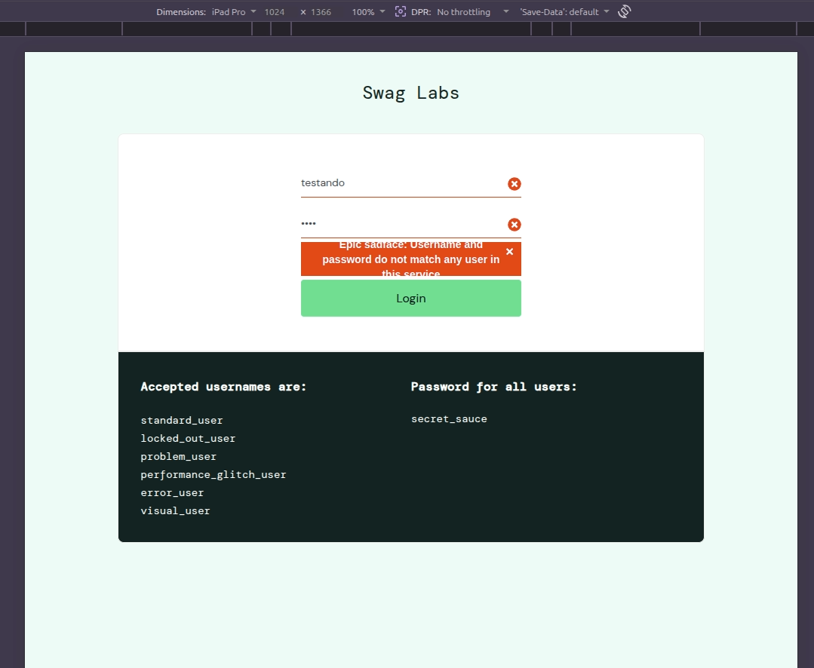
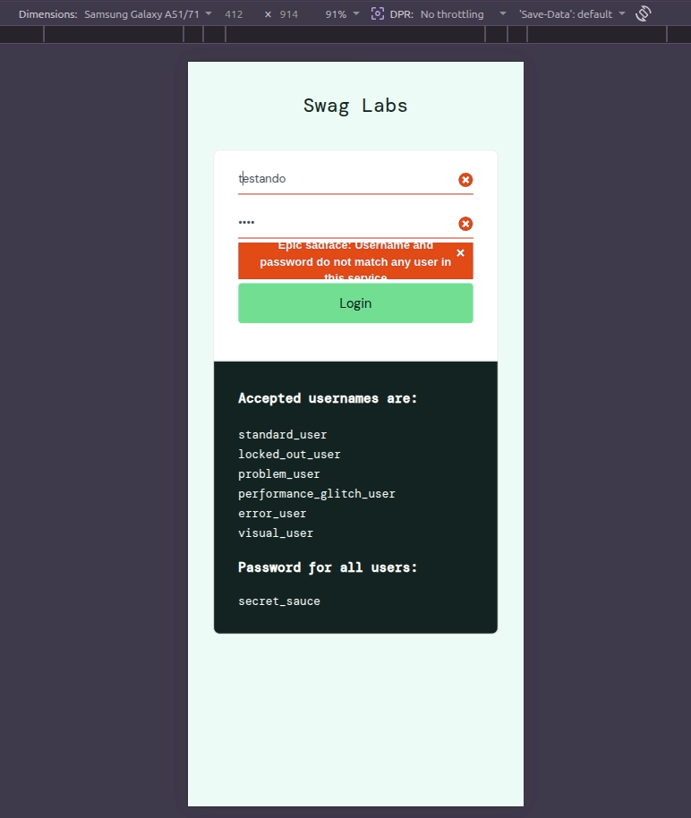

## 🐞 #01 [Login] Falha ao autenticar com espaços no início/fim do username
Ao inserir um username válido com espaços em branco no início e/ou fim, o sistema não autentica o usuário e exibe mensagem de erro, mesmo com credenciais corretas.    

## 🔁 Passos para reproduzir
1. Acessar https://www.saucedemo.com/
2. No campo **Username**, inserir **" standard_user "** (com espaços no início e/ou fim)
3. No campo **Password**, inserir **secret_sauce** 
5. Clicar no botão **Login**

## ❌ Resultado Atual
Sistema exibe a mensagem:  
**"Epic sadface: Username and password do not match any user in this service"**   
e não realiza o login.

## ✅ Comportamento Esperado
O sistema deve autenticar usuários válidos ao inserir credenciais corretas, independentemente de espaços em branco acidentais no início ou fim do campo **Username**.

## 💥 Impacto
Usuários válidos podem não conseguir acessar a aplicação devido a entrada com espaços acidentais, impactando a experiência e potencialmente aumentando tentativas de login incorretas.

## 🚨 Severidade | ⏱️ Prioridade
Média | Média

## 🌍 Ambiente Testado
- SO: Linux e Android
- Navegadores: Chrome (147.0.7727.137) e Firefox (150.0.1)

## 📸 Evidência

---
---

## 🐞 #02 [Login] Mensagem de erro com padding insuficiente compromete legibilidade
Ao realizar login com credenciais inválidas, a mensagem de erro exibida apresenta espaçamento interno (padding) inadequado, fazendo com que o texto fique visualmente comprimido e parcialmente oculto.

## 🔁 Passos para reproduzir
1. Acessar https://www.saucedemo.com/
2. Inserir dados inválidos nos campos **Username** e **Password**
3. Clicar no botão **Login**

## ❌ Resultado Atual
A mensagem:  
**"Epic sadface: Username and password do not match any user in this service"**   
é exibida com padding insuficiente, resultando em texto comprimido e com possível corte visual.

## ✅ Comportamento Esperado
A mensagem de erro deve ser exibida com espaçamento interno adequado, garantindo legibilidade completa e consistência visual em diferentes resoluções.

## 💥 Impacto
O problema compromete a legibilidade da mensagem de erro e pode afetar a experiência do usuário em diferentes resoluções, além de impactar critérios básicos de usabilidade e acessibilidade.

## 🚨 Severidade | ⏱️ Prioridade
Baixa | Baixa

## 🌍 Ambiente Testado
- SO: Linux e Android
- Navegadores: Chrome (147.0.7727.137) e Firefox (150.0.1)
- Dispositivos: Desktop, Tablet e Mobile

## 📸 Evidência
Desktop

Tablet

Mobile
